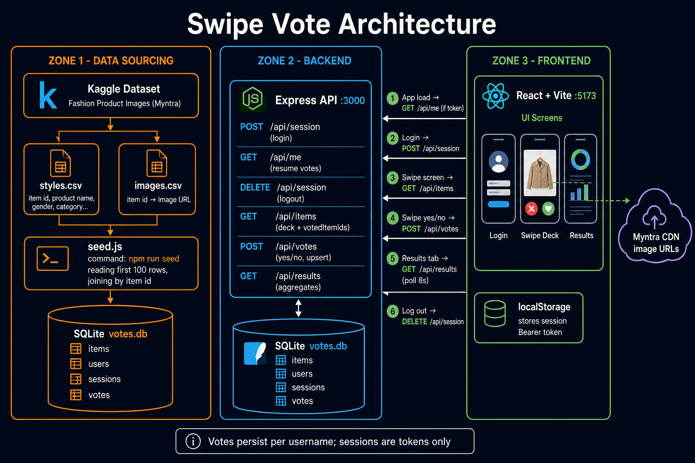

# Swipe Vote — Style Check

Mobile-first web app where you swipe through **clothing looks** and vote **yes** (approve) or **no** (pass). Community results show aggregate yes/no counts across all users.

**Theme:** Would you wear or buy this item? Each card shows a product photo, name, and style details from the Myntra-style dataset in `server/data/`. Dataset pulled from Kaggle by Param Aggarwal (https://www.kaggle.com/datasets/paramaggarwal/fashion-product-images-dataset)

## Project layout

```
project/
  client/          # React + Vite frontend
  server/          # Express + SQLite API
  server/seed.js   # Seeds 100 items from styles.csv + images.csv
  server/data/     # styles.csv, images.csv, votes.db (sqlite database)
```

## Quick start

### 1. Backend

make a new folder ./server/data and move imaegs.csv and styles.csv into there (having a gitignore issue, to be fixed)

```bash
cd server
npm install
npm run seed        # first time, or npm run seed:force to reset databases
npm start
```

API: **http://localhost:3000**

### 2. Frontend

```bash
cd client
npm install
npm run dev
```

Open **http://localhost:5173** (Vite proxies `/api` to the backend).

## Architecture



The **Express** server owns all vote data in **SQLite** (`server/data/votes.db`). Users sign in with a **username** (no password). Votes are keyed by `(user_id, item_id)` with a unique constraint and SQLite `ON CONFLICT` upsert so **repeat votes update rather than double-count for idempotency**.

The **React** client loads the deck of items the user has not voted on yet, supports pointer swipe and yes/no buttons, and offers a results screen with sort tabs (most loved, most divisive, most skipped). Results poll every 8 seconds while open to meet real-time updating stretch goal.

**Why SQLite:** Zero-config, single file, fine for local demo and class scale; `better-sqlite3` gives synchronous queries without an ORM. Using SQLite over a dedicated MySQL server also cuts down on installation and setup requirements.

**Images:** Loaded from `images.csv` (Myntra asset URLs linked by style id). Requires network access to load photos in the browser.

## Requirements checklist

### Core

| # | Requirement | Status |
|---|-------------|--------|
| 1 | Voting theme documented | ✅ Clothing / style approval |
| 2 | 100+ items with image + label | ✅ 100 from CSV (`npm run seed`) |
| 3 | Swipe UI yes/no  | ✅ |
| 4 | Results view + sort/filter | ✅ 3 sort modes |
| 5 | Server persistence | ✅ SQLite |
| 6 | End-of-deck state | ✅ |

### Stretch

| # | Feature | Status |
|---|---------|--------|
| 7 | User identity (username session) | ✅ |
| 8 | Previous / review past votes | ✅ |
| 9 | Matches view | ❌ |
| 10 | Real-time results | ✅ 8s polling on results screen |
| 11 | Admin seed script | ✅ `npm run seed` |
| 12 | Analytics | ❌ |

## Known issues

- Swipe-down to open results is a light touch gesture on the card stack; the 
- data folder committing issue, requires manual import of images.csv and styles.csv
**Results ↓** button is the reliable control.

## Demo

https://youtu.be/EFd6mr8GBqY

## AI Usage

See **AI_NOTES.md** for AI usage write-up